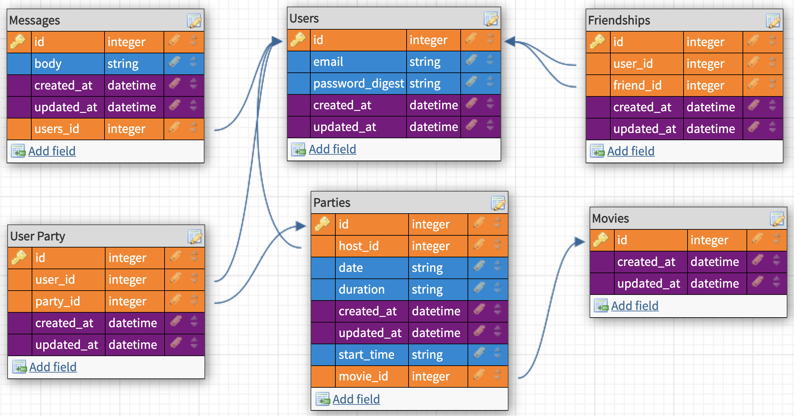

# Viewing Party


This is the base repo for the [viewing party project](https://backend.turing.io/module3/projects/viewing_party) used for Turing's Backend Module 3.

Application built to discover movies, and create parties that you can invite your friends to. You will need to register as a user to access dashboard features. You can then see Top Rated Movies, or search for a movie by name. Also once registered you will be able to enter the chatroom, where you can live chat with other Viewing Party users.


## Table of Contents

  - [Authors](#authors)
  - [Getting Started](#getting-started)
  - [Runing the tests](#running-the-tests)
  - [Deployment](#deployment)
  - [Built With](#built-with)
  - [Versioning](#versioning)

## Authors

  - **Tommy Nieuwenhuis** -
    [Tommy's GitHub](https://github.com/tsnieuwen)
    [Tommy's LinkedIn](https://www.linkedin.com/in/thomasnieuwenhuis/)
  - **Kris Litman** -
    [Kris' GitHub](https://github.com/krislitman)
    [Kris' LinkedIn](https://www.linkedin.com/in/kris-litman-7095351a4/)

## Getting Started

### Installing

These instructions will get you a copy of the project up and running on
your local machine for development and testing purposes. See deployment
for notes on how to deploy the project on a live system.

1. Fork and Clone the repo
2. Install gem packages: `bundle install`
3. Setup the database: `rails db:create`
4. Set up the tables: `rails db:migrate`
5. Start local server: `rails s`
6. In your browser, navigate to `http://localhost:3000/`
7. Enjoy the app!

## Overview

### Database Schema

The database schema is comprised of six tables: `users, parties, user parties, movies, friendships, and messages`. The `friendships` table is self-referencing and displaces relationships between users of the application. `Users` can be associated to a party in either one of two ways:

1. If a hosting a party, the user's id will be stored in the `host_id` column of the parties table.
2. If invited to a party, the user's id as well as the party's id will be used to create a record in the user party table.



### API Consumption
A total of five Movie DB API endpoint calls are made in this application to meet the following functionality:
1. Return top-rated movies
2. Return movies that match a search query
3. Return a movie by a unique identifier
4. Return a specific movie's reviews
5. Return a specific movie's cast members

The API end points are called through a casade of calls, starting from a controller, to a facade, to a service, and final a poro (Plain Old Ruby Object). See below for example code:

`MoviesController` `show` action calling `MovieFacade`:


```
class MoviesController < ApplicationController

  def show
    @movie = Movie.find_by(api_id: params[:id])
    @movie_info = MovieFacade.show_movie(@movie.api_id)
    @details = MovieFacade.movie_details(@movie.api_id)

    return unless @movie.nil? || @movie_info.nil?

    flash[:notice] = 'An error occured, please try again'
    redirect_to discover_index_path

  end
```

`MovieFacade` calling the `MovieService` `show_movie`:
```
class MovieFacade

  def self.show_movie(api_id)
    MovieService.show_movie(api_id)
  end

end
```
`MovieService` `show_movie` method calling the `ShowMovie` poro:
```

class MovieService
  extend Connect

  def self.show_movie(api_id)
    response = conn.get("3/movie/#{api_id}")
    attributes = JSON.parse(response.body, symbolize_names: true)
    ShowMovie.new(attributes)
  end

end
```

`ShowMovie` poro returning a temporary `ShowMovie` object, which will be displayed on web application:
```
class ShowMovie

  attr_reader :api_id,
              :title,
              :summary,
              :runtime,
              :vote_average,
              :genres,
              :hours,
              :minutes,
              :poster

  def initialize(data)
    @api_id = data[:id]
    @title = data[:title]
    @summary = data[:overview]
    @hours = (data[:runtime] / 60)
    @minutes = (data[:runtime] % 60)
    @runtime = data[:runtime]
    @vote_average = data[:vote_average]
    @genres = data[:genres]
    @poster = data[:poster_path]
  end

end
```

In order to DRY up the code and make the API calls as efficient as possible, a `Connect` module was also created and implemented within `MovieService`.

## Running the tests

There are sixty-nine facade, feature, model, poro, and service tests written for this application, resulting in 100% test coverage. The test suite is run by entering `bundle exec rspec` in the terminal.

### Example feature test
The following is a feature test for the movie detail show page of the application. Testing involves performing a call to the Movie DB API, which is then stored in the `single_movie_details1010` VCR cassette.
```
require 'rails_helper'

RSpec.describe 'As an authenticated user' do
  describe 'When I visit a movies detail page' do
    it 'Should have a button to create viewing party' do
      UserParty.destroy_all
      Party.destroy_all
      Movie.destroy_all
      user = User.create(
        email: 'foo@bar.com',
        password: 'test'
      )
      expected = Movie.all
      expect(expected).to be_empty
      allow_any_instance_of(ApplicationController).to receive(:current_user).and_return(user)

      VCR.use_cassette('single_movie_details1010') do
      visit movie_path("#{Figaro.env.movie_details}")
      expected2 = Movie.all
      expect(expected2).not_to be_empty
      expect(page).to have_button("Create Viewing Party for The Lord of the Rings")
      expect(page).to have_content("The Lord of the Rings")
      expect(page).to have_content("6.5")
      expect(page).to have_content("Adventure")
      expect(page).to have_content("Animation")
      expect(page).to have_content("Fantasy")
      expect(page).to have_content("The Fellowship of the Ring embark")
      expect(page).to have_content("Total Reviews: 0")
      expect(page).to have_content("Christopher Guard as Frodo")
      end
    end
  end
end
```


### And coding style tests

Explain what these tests test and why

    Give an example

## Deployment

This application is deployed to heroku and can be found at https://damp-fjord-30128.herokuapp.com/

## Built With

- Ruby
- Rails
- HTML
- CSS
- Bootstrap

## Versions

- Ruby 2.5.3

- Rails 5.2.4.3

Example wireframes to follow are found [here](https://backend.turing.io/module3/projects/viewing_party/wireframes)
